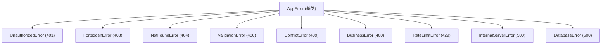

# 错误处理

## 错误类型体系

所有自定义错误继承自 `AppError` 基类，位于 `src/lib/errors/types.ts`。



### AppError 定义

```ts
export class AppError extends Error {
  public readonly httpStatus: number; // HTTP 状态码
  public readonly code: string; // 业务错误码（如 'UNAUTHORIZED'）
  public readonly isOperational: boolean; // 是否为可预期操作错误 (4xx)
  public readonly details?: unknown; // 错误详情（生产环境自动隐藏）

  constructor(message: string, code: string, options: AppErrorOptions = {}) {
    super(message, { cause: options.cause });
    // ...
  }
}
```

### 使用方式

```ts
// Service 层直接 throw，由全局错误处理器自动捕获
throw new UnauthorizedError("未登录或登录已过期");
throw new ForbiddenError("无权限执行此操作");
throw new NotFoundError("管理员", id); // → "管理员 with id 123 not found"
throw new ConflictError("用户名已存在");
throw new BusinessError("不能删除自己的账号", ErrorCode.CANNOT_DELETE_SELF);
throw new ValidationError("无效的父级菜单");
throw new RateLimitError();
```

## 错误码

```ts
// src/lib/errors/codes.ts
export const ErrorCode = {
  // === 客户端错误 4xx ===
  VALIDATION_ERROR: "VALIDATION_ERROR", // 400
  UNAUTHORIZED: "UNAUTHORIZED", // 401
  FORBIDDEN: "FORBIDDEN", // 403
  NOT_FOUND: "NOT_FOUND", // 404
  CONFLICT: "CONFLICT", // 409
  TOO_MANY_REQUESTS: "TOO_MANY_REQUESTS", // 429

  // === 业务错误 ===
  BUSINESS_ERROR: "BUSINESS_ERROR",
  CANNOT_DELETE_SUPER_ADMIN: "CANNOT_DELETE_SUPER_ADMIN",
  CANNOT_DELETE_SELF: "CANNOT_DELETE_SELF",
  CANNOT_MODIFY_SUPER_ADMIN: "CANNOT_MODIFY_SUPER_ADMIN",
  CANNOT_MODIFY_SUPER_ADMIN_ROLES: "CANNOT_MODIFY_SUPER_ADMIN_ROLES",
  ACCOUNT_DISABLED: "ACCOUNT_DISABLED",
  INVALID_PARENT: "INVALID_PARENT",
  HAS_CHILDREN: "HAS_CHILDREN",
  ROLE_IN_USE: "ROLE_IN_USE",
  STORAGE_NOT_CONFIGURED: "STORAGE_NOT_CONFIGURED", // 存储服务未配置
  STORAGE_UNAVAILABLE: "STORAGE_UNAVAILABLE",        // 存储服务不可用

  // === 服务器错误 5xx ===
  INTERNAL_ERROR: "INTERNAL_ERROR",
  DATABASE_ERROR: "DATABASE_ERROR",
  HTTP_ERROR: "HTTP_ERROR", // 兼容旧版及 Hono HTTPException
};
```

## 全局错误处理

全局错误处理位于 `src/server/setup/error-handlers.ts`，通过 `setupErrorHandlers(app)` 注册，包含 `app.onError` 和 `app.notFound` 两个处理器。

### 核心处理顺序

1. **HTTPException（优先）**: Hono 框架内部异常（如 malformed JSON 等边界情况）优先匹配。保留原始状态码，补齐 `requestId` 响应头；5xx 级别同时触发 `reportError` 上报。
2. **AppError 及未知错误**: 通过 `mapErrorToResponse(err, requestId)` 统一处理——`AppError` 子类直接映射，未知错误包装为 `InternalServerError (500)` 后脱敏输出。

### app.notFound 处理器

当请求路径未匹配任何路由时，返回标准 404 响应：

```ts
app.notFound((c) => {
  return c.json(
    {
      code: ErrorCode.NOT_FOUND,
      message: `Route ${c.req.method} ${c.req.path} not found`,
      requestId: c.get('requestId'),
    },
    404
  )
})
```

### 响应格式标准

```json
{
  "code": "VALIDATION_ERROR",
  "message": "请求参数校验失败",
  "details": {
    "issues": [
      {
        "path": "username",
        "message": "Required",
        "code": "invalid_type",
        "source": "json"
      }
    ]
  },
  "requestId": "req-abc-123"
}
```

> [!NOTE]
> 在生产环境下，`isOperational: false` 的错误（如 500 错误）会自动脱敏：`message` 将被 `getSafeMessage` 重写为"服务器内部错误"，且 `details` 会被清除，防止内部堆栈信息泄露。

## 参数校验 (zValidator)

项目封装了 `zValidator` (`src/server/utils/validator.ts`)，它在校验失败时会抛出 `ValidationError`，从而进入统一错误流程。

```ts
import { zValidator } from "@/server/utils/validator";

app.post(
  "/api/admins",
  zValidator("json", CreateAdminInputSchema),
  async (c) => {
    // 此时数据已校验通过
    const data = c.req.valid("json");
  },
);
```

## 错误监控与告警

### ErrorMonitor 接口

可以通过 `addErrorMonitor` 注册多个错误监听器（如日志记录、Sentry 上报）。

```ts
// src/lib/errors/monitor.ts
export interface ErrorMonitor {
  captureError(error: Error, context?: Record<string, unknown>): void;
}
```

### reportError 函数

`reportError` 是统一的错误上报入口，负责将错误分发给所有已注册的监控消费者。默认注册了 `LoggerMonitor`（结构化日志落地），确保即使未配置外部监控，错误也有日志记录。

```ts
// 通知所有监控消费者（日志落地、Sentry 上报等）
reportError(error, { requestId, errorCode })
```

每个消费者的异常会被静默捕获，防止 monitor 自身的故障中断主错误处理链。

### 集成示例（Sentry）

```ts
import * as Sentry from '@sentry/node'
import { addErrorMonitor } from '@/lib/errors'

class SentryMonitor implements ErrorMonitor {
  captureError(error: Error, context?: Record<string, unknown>): void {
    Sentry.captureException(error, { extra: context })
  }
}

Sentry.init({ dsn: env.SENTRY_DSN })
addErrorMonitor(new SentryMonitor())
```

### 数据库错误转换

使用 `handleDatabaseError` 将底层数据库驱动抛出的错误（如 MySQL 唯一键冲突）映射为应用层错误：

```ts
try {
  await db.insert(sysAdmin).values(data);
} catch (err) {
  throw handleDatabaseError(err); // 自动识别 1062 等错误码
}
```

## 前端处理

前端通过 `unwrapApiData` 或统一拦截器处理错误响应。业务代码中可以直接从 `isError` 状态或 `error.message` 获取友好的提示信息。

```ts
const { mutate } = useMutation({
  onError: (err: AppError) => {
    toast.error(err.message);
  },
});
```
